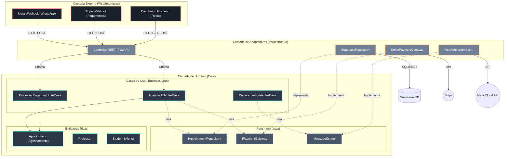

# Arquitetura e Fluxos de Negócio (AgendaPro)

> **Nota para o Diretor:** Como você é o guardião do escopo do projeto, eu consolidei a visão da nossa aplicação em **dois diagramas** fundamentais. Um mostra *como o dinheiro e os dados fluem* (Negócios) e o outro mostra *como o código é organizado* para nunca quebrar (Hexagonal).

---

## 1. Diagrama de Negócios (A Jornada do Usuário)
*Como o sistema converte uma mensagem de WhatsApp em dinheiro no banco e horário na agenda.*

```mermaid
sequenceDiagram
    autonumber
    actor Aluno as Aluno (WhatsApp)
    participant Meta as Meta API (WhatsApp)
    participant FastAPI as Backend (IA/FastAPI)
    participant DB as Supabase (Agenda/Lock)
    participant Pagamento as Stripe (Gateway)
    participant GCal as Google Calendar

    Aluno->>Meta: "Quero agendar uma aula de inglês amanhã"
    Meta->>FastAPI: Webhook (Nova Mensagem recebida)
    
    rect rgb(40, 44, 52)
        Note over FastAPI,DB: Processamento da IA Conversacional
        FastAPI->>DB: Checa disponibilidade no dia
        DB-->>FastAPI: Retorna horários vagos
        FastAPI->>Meta: IA Sugere opções de horário
    end
    
    Aluno->>Meta: "Quero às 14h!"
    Meta->>FastAPI: Webhook (Escolha do horário)
    
    rect rgb(60, 40, 40)
        Note over FastAPI,Pagamento: Prevenção de Double Booking (Lock de 10 min)
        FastAPI->>DB: Applica Lock no Slot das 14h (Status: PENDENTE)
        FastAPI->>Pagamento: Gera Link de Pagamento (Checkout)
        Pagamento-->>FastAPI: Retorna URL de Pagamento
        FastAPI->>Meta: "Perfeito! Segue o link para confirmar: [URL]"
    end
    
    Aluno->>Pagamento: Realiza o Pagamento via Cartão/Pix
    Pagamento->>FastAPI: Webhook (Pagamento Confirmado)
    
    rect rgb(40, 60, 40)
        Note over FastAPI,GCal: Efetivação do Serviço
        FastAPI->>DB: Atualiza Slot das 14h (Status: CONFIRMADO)
        FastAPI->>GCal: Sincroniza evento na agenda do Professor
        FastAPI->>Meta: Envia Recibo e Link do Meet/Zoom para o Aluno
    end
```

---

## 2. Diagrama da Arquitetura de Software (Clean Architecture / Hexagonal)
*Como o nosso código é isolado modularmente para que a troca de um banco de dados ou da API do WhatsApp não quebre a lógica do agendamento.*

### Por que esse formato é o melhor?
1. **O Diagrama de Sequência (Negócios):** Permite a você acompanhar exatamente onde uma métrica pode falhar (por exemplo, percebemos que entre gerar o lock e o aluno pagar, temos 10 minutos de retenção).
2. **O Diagrama Hexagonal (Arquitetura):** Permite que quando você ordene o Claude testar a `Trilha B`, nós só apontemos o terminal dele para um bloquinho cinza (`SupabaseRepository`), e ele é PROIBIDO, mecanicamente, de esbarrar nos outros subsistemas.
